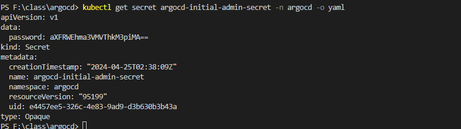

# ArgoCD Installation and Setup

This guide walks you through setting up ArgoCD and deploying applications using it.

## Pre-requisites
- Have access to a Kubernetes cluster (Minikube, EKS, or Kubeadm)
- GitHub account to store Kubernetes configuration files

## Setup GitHub Repository
- Create a new GitHub repository to store your Kubernetes configuration files.
- Push your Kubernetes deployment file (deploy.yml) to this repository.
- Create deploy.yml file or put Kubernetes file

```
apiVersion: apps/v1
kind: Deployment
metadata:
  name: hello
spec:
  replicas: 3
  selector:
    matchLabels:
      app: hello
  template:
    metadata:
      labels:
        app: hello
    spec:
      containers:
        - name: hello-microservice
          image: "public.ecr.aws/t5n9y4h0/suri-simple-mern-be-micro-hello-service:latest"
          imagePullPolicy: Always
          resources:
            limits:
              memory: "128Mi"
              cpu: "500m"
          ports:
            - containerPort: 3001
          env:
            - name: PORT
              value: "3001"

```

## Deploy Application

- Apply the deployment file to your Kubernetes cluster:

```bash
kubectl apply -f deploy.yml
kubectl get deployment
kubectl get pod 
```

- Push your deploy.yml file into the GitHub repository

```bash
git add .\deploy.yml
git commit -m "WIP: adding the deployement hello k8s"
git push 
```

## Install ArgoCD

- Create a namespace for ArgoCD:

```bash
kubectl create namespace argocd
```

- Install ArgoCD using the provided manifest:

```bash
kubectl apply -n argocd -f https://raw.githubusercontent.com/argoproj/argo-cd/stable/manifests/install.yaml
```

## Access ArgoCD Dashboard

- Check the deployment status of ArgoCD components:
- See what is argocd created inside my cluster

```bash
kubectl get pod -n argocd
kubectl get svc -n argocd

```

## Access ArgoCD Dashboard

- Forward the ArgoCD server port to localhost:
- To see argocd dashboard

```bash
kubectl port-forward -n argocd  svc/argocd-server 5000:443

```
- Access the ArgoCD dashboard at https://localhost:5000.
  


## Retrieve ArgoCD Admin Password

- If ArgoCD is running as a Service, use the following command to retrieve the admin password:

```bash
argocd admin initial-password -n argocd

```


- If ArgoCD is not running as a Service, use:

```bash
kubectl get secret argocd-initial-admin-secret -n argocd -o yaml

```




- This is used get password directly:
  
```bash
kubectl get secret argocd-initial-admin-secret -n argocd -o jsonpath="{.data.password}" | base64 -d
```


## Deploy Application with ArgoCD
- Create an application manifest (application.yml) to deploy your application using ArgoCD.
- Create application.yml file you can also use to create git connect from argocd Dashboard (+ NEW APP) Button

```
apiVersion: argoproj.io/v1alpha1
kind: Application
metadata:
  name: mycool-argocd-app
  namespace: argocd
spec:
  project: default
  source:
    repoURL: https://github.com/surendergupta/argocd.git
    targetRevision: HEAD
    path: guestbook
  destination:
    server: https://kubernetes.default.svc
    namespace: myapp
  syncPolicy:
    automated:
      prune: true
      selfHeal: true
```
- Apply the application manifest to your Kubernetes cluster:

```bash
kubectl apply -f .\application.yml
```

## Access ArgoCD Dashboard


- Till now it is not fully configured it will take time


